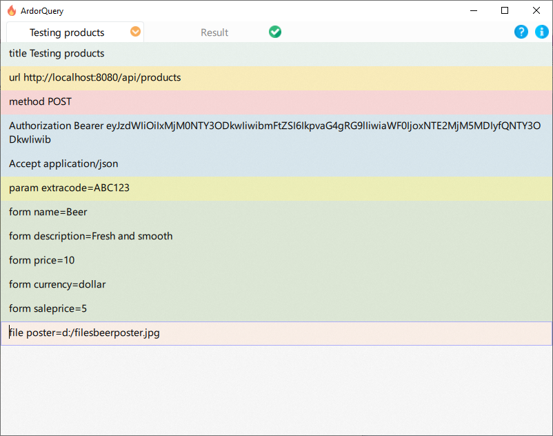

# ArdorQuery

Cross-platform desktop is a tool for making HTTP(S) requests from websites or RESTful APIs. Similar to cURL, but with a graphical interface.
Can be used for testing and/or developing web applications. Application have minimal user interface and keyboard oriented.
The HTTP request is broken down into a human-readable set of lines. Each line describes the type at the beginning, for example `url ` means we define the URL for the HTTP request.
Each type of line has a different color to help visually identify that content.    

## Install

Installation instructions for your operating system at this [link](install.md).

## Getting started

* [Getting started and Basic shortcuts](basicshortcuts.md)
* [Basic Fields](commonfields.md)
* [Available query options](options.md)
* [Write a scripts](postscript.md)

## Feedback

If you find a bug or have suggestions for the application, feel free to post an issue or discussion in the [repository](https://github.com/trueromanus/ArdorQuery).